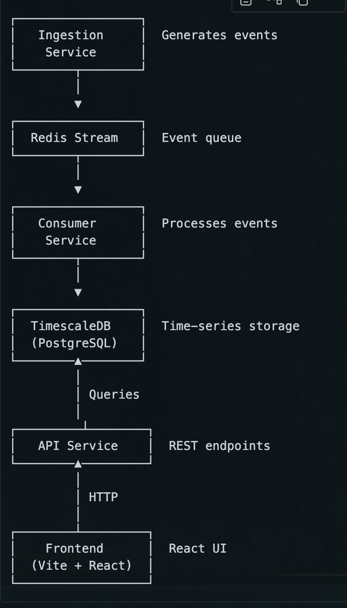

# Real-Time Analytics Pipeline

## Project Overview
Build a production-grade analytics system that ingests events, processes them in real-time, stores them efficiently, and visualizes metrics on a live dashboard.

**End Goal:** A system that can handle 100,000 events per hour continuously, with a dashboard showing real-time metrics and the ability to query historical data.

## Architecture



The system consists of four main components:

1. **Ingestion Service** - Generates and publishes events to Redis Stream
2. **Consumer Service** - Processes events from Redis Stream and stores them in TimescaleDB
3. **API Service** - Provides REST endpoints to query data from TimescaleDB
4. **Frontend** - React-based dashboard for real-time visualization

## Tech Stack

### Backend
- **Runtime:** Node.js with TypeScript
- **Message Queue:** Redis Streams
- **Database:** TimescaleDB (PostgreSQL extension for time-series data)
- **Key Libraries:** Express, ioredis, pg, ws, zod

### Frontend
- **Framework:** React 19
- **Build Tool:** Vite 7
- **Styling:** Tailwind CSS 4
- **Language:** TypeScript

### Infrastructure
- **Container Management:** Docker & Docker Compose
- **Services:** Redis 7, TimescaleDB (PostgreSQL 16)

## Quick Start

### Prerequisites
- Docker Desktop installed and running
- Node.js (v18 or higher)
- npm or yarn

### 1. Start Infrastructure Services
```bash
cd infra
docker-compose up -d
```

This starts:
- Redis on `localhost:6379`
- TimescaleDB on `localhost:5432`

### 2. Set Up Backend
```bash
cd backend
npm install
```

### 3. Run Services

**API Service** (coming soon):
```bash
npm run dev
```

**Ingestion Service** (event generator):
```bash
npm run ingestion
```

**Consumer Service** (event processor):
```bash
npm run consumer
```

The ingestion service generates realistic analytics events and publishes them to Redis Stream at a configurable rate. The consumer service reads these events and stores them in TimescaleDB.

### 4. Verify System
Check that events are being generated:
```bash
docker exec -it analytics-redis redis-cli XLEN analytics_events
```

## Project Structure

```
Analytics-Pipeline/
├── backend/           # Node.js/TypeScript backend services
│   ├── api/          # REST API server (placeholder)
│   ├── consumer/     # Event consumer service (complete)
│   ├── ingestion/    # Event producer/generator (complete)
│   └── shared/       # Shared utilities and config (complete)
├── frontend/         # React frontend application (planned)
├── infra/            # Docker infrastructure configuration (complete)
└── scripts/          # Utility scripts (empty)
```

## Development Status and schema creation
- [x] Project structure and organization
- [x] Event schema definition with 4 event types
- [x] Event ingestion service with rate control and burst mode
- [x] Redis Stream integration with 100K+ events tested
- [x] Stability testing (1.5 hours, zero errors)
- [x] TimescaleDB schema with hypertable optimization
- [x] Event consumer service with batch processing
- [x] Performance monitoring and metrics tracking
- [x] Consumer lag monitoring with CSV export

### In Progress
- [ ] REST API endpoints
- [ ] Frontend dashboard

## Useful Commands

```bash
# Backend Services
cd backend
npm run dev              # Run API service (coming soon)
npm run ingestion        # Run event generator
npm run consumer         # Run event consumer

# Verify Event Stream
docker exec -it analytics-redis redis-cli XLEN analytics_events

# Check Database Records
docker exec -it analytics-timescaledb psql -U analytics_user -d analytics -c "SELECT COUNT(*) FROM events;"

# View Consumer Metrics
cat backend/metrics.csv

# Docker Management
docker-compose up -d      # Start containers
docker-compose down       # Stop containers
docker ps                 # Check container status

# Check Logs
docker logs analytics-redis
docker logs analytics-timescaledb
```

## Database Credentials

**TimescaleDB:**
- Host: `localhost:5432`
- Database: `analytics`
- User: `analytics_user`
- Password: `analytics_pass`

**Redis:**
- URL: `redis://localhost:6379`

## Documentation

- [Backend Documentation](backend/README.md)
- [Consumer Service](backend/consumer/README.md)
- [Ingestion Service](backend/ingestion/README.md)
- [Shared Modules](backend/shared/README.md)
- [Event Schema Documentation](backend/ingestion/SCHEMA.md)
- [Frontend Documentation](frontend/README.md)
- [Infrastructure Setup](infra/README.md)

## License

MIT